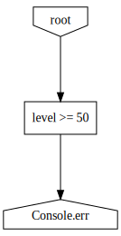
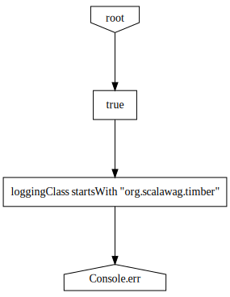
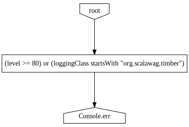
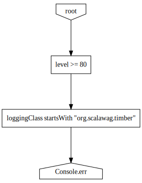
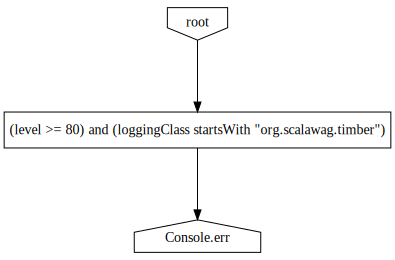
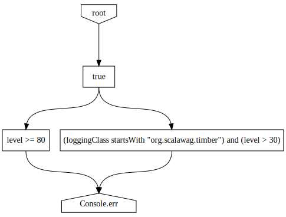
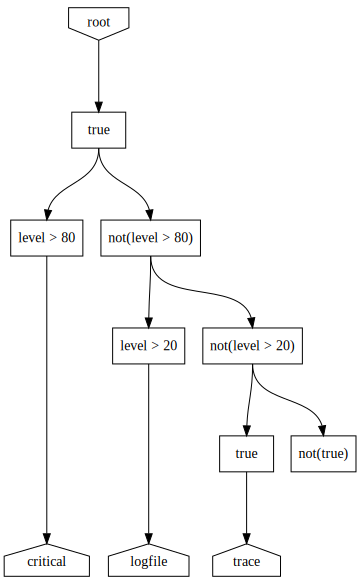
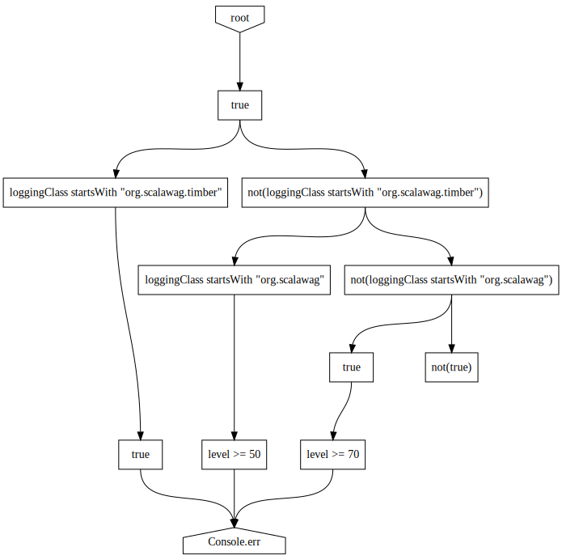
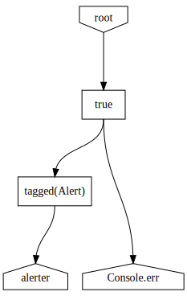

## Concepts

A `Configuration` is used in timber to tell a [dispatcher](Dispatchers) which [entries](Entries) to route to which
[receivers](Receivers).  It takes the form of a
[directed acyclic graph](http://en.wikipedia.org/wiki/Directed_acyclic_graph) (DAG).  At each vertex in the graph
lies either a [condition](Conditions) or a receiver.

Condition vertices can have any number of outbound edges which each lead to either another condition vertex or a
receiver vertex. Receiver vertices are leaf nodes and cannot have outbound edges.

A configuration has a set of vertices called the _roots_ where evaluation starts for each entry. To determine which
receivers will receive a particular entry, a dispatcher considers every path through the configuration DAG from a
root vertex to a receiver vertex. A path accepts the entry if and only if every condition along the path accepts
the entry.  A single rejecting condition prevents the receiver from receiving the entry (through this path, at
least). Conditions are evaluated in order from the root to the receiver, so placing more discriminating conditions
closer to the root results in better performance.  A path with no conditions (if a receiver vertex _is_ a root)
automatically accepts all entries. If a path accepts an entry, its terminal receiver receives the entry.

Multiple paths can terminate at the same receiver.  This simply means that there are several sets of criteria which
may result in an entry being received by that receiver.  If more than one of these paths accept the entry, the
receiver still only receives the entry once.

At first, this may seem more complicated than it really is once you begin using the timber configuration DSL.

## Examples

The best way to learn the DSL is to look at some examples.  Here's a simple graph that logs to stderr only entries
that have a level of `INFO` or higher.

~~~~
import org.scalawag.timber.api.level.Level._
import org.scalawag.timber.backend.dispatcher.configuration.dsl._

( level >= INFO ) ~> stderr
~~~~
{: .language-scala}

Here's a visualization of that graph.  Click on the thumbnail to get a larger version.

[{: height="150px"}](graph/a.svg)

Here's another that prints _anything_ logged from the timber package but only `ERROR` messages otherwise.  It
demonstrates that, to achieve an "or", you can wire up two conditions in parallel.

~~~~
import org.scalawag.timber.api.level.Level._
import org.scalawag.timber.backend.dispatcher.configuration.dsl._

val in = Condition(true)
in ~> ( level >= ERROR ) ~> stderr
in ~> ( loggingClass startsWith "org.scalawag.timber" ) ~> stderr
~~~~
{: .language-scala}

[{: height="150px"}](graph/b.svg)

This also demonstrates the use of `Condition(Boolean)` to create a condition vertex that always either accepts
(for `true`) or rejects (for `false`) each entry, no matter what its content.  Sometimes, it's useful to create
a condition vertex like this just to help in creating your graph.  I did this here so that I would have something
to attach multiple edges to.  It's basically just an aggregation or distribution point.

You can also use logical operations on conditions, if you prefer.

~~~~
import org.scalawag.timber.api.level.Level._
import org.scalawag.timber.backend.dispatcher.configuration.dsl._

( ( level >= ERROR ) || ( loggingClass startsWith "org.scalawag.timber" ) ) ~> stderr
~~~~
{: .language-scala}

[{: height="150px"}](graph/c.svg)

Operator precedence rules may dictate a lot of parentheses.

To achieve "and"-like behavior, you can either wire up two conditions in series.

~~~~
import org.scalawag.timber.api.level.Level._
import org.scalawag.timber.backend.dispatcher.configuration.dsl._

( level >= ERROR ) ~> ( loggingClass startsWith "org.scalawag.timber" ) ~> stderr
~~~~
{: .language-scala}

[{: height="150px"}](graph/d.svg)

Similar to the "or" case above, you can use an "and" logical operation instead.

~~~~
import org.scalawag.timber.api.level.Level._
import org.scalawag.timber.backend.dispatcher.configuration.dsl._

( ( level >= ERROR ) && ( loggingClass startsWith "org.scalawag.timber" ) ) ~> stderr
~~~~
{: .language-scala}

[{: height="150px"}](graph/e.svg)

Some patterns are common enough that they have a shortcuts.  When you want to add a bunch of edges in parallel, use the `fanout` function.

~~~~
import org.scalawag.timber.api.level.Level._
import org.scalawag.timber.backend.dispatcher.configuration.dsl._

fanout (
  level >= ERROR,
  ( loggingClass startsWith "org.scalawag.timber" ) and ( level > DEBUG )
) ~> stderr
~~~~
{: .language-scala}

[{: height="150px"}](graph/f.svg)

After a `fanout`, you can add an edge and it will be added to the last vertex of each subgraph listed in the fanout.

If you want to create a structure where exactly one of a set of conditions determines the accepted path, use the `choose` function.

~~~~
import org.scalawag.timber.api.level.Level._
import org.scalawag.timber.backend.receiver._
import org.scalawag.timber.backend.dispatcher.configuration.dsl._

val critical: Receiver = null
val logfile: Receiver = null
val trace: Receiver = null

choose (
  when( level > ERROR ) ~> critical,
  when( level > TRACE ) ~> logfile,
  otherwise ~> trace
)
~~~~
{: .language-scala}

[{: height="150px"}](graph/g.svg)

You'd obviously want to create real receivers here instead of just using null. :)

You can fan-in after a `choose` just like `fanout`.  This will add an edge to each subgraph resulting from the choose.

~~~~
import org.scalawag.timber.api.level.Level._
import org.scalawag.timber.backend.dispatcher.configuration.dsl._

choose (
  when( loggingClass startsWith "org.scalawag.timber" ) ~> true,
  when( loggingClass startsWith "org.scalawag" ) ~> ( level >= INFO ),
  otherwise ~> ( level >= WARN )
) ~> stderr
~~~~
{: .language-scala}

[{: height="150px"}](graph/h.svg)

This also illustrates the use of a Boolean as a condition.  Above, we created a similar vertex but we have to use the `Condition(Boolean)` factory method.  That's because, in that case, the compiler couldn't have known that we wanted a vertex instead of a Boolean.  In this case, the compiler knows that `~>` requires a Boolean, so it implicitly converts it for us.

Of course, your graph may not have anything to do with entry levels and your receivers may not all be writing to log files.  This graph writes everything to stderr and send any entry tagged with `Alert` to the `alerter` receiver as well.

~~~~
import org.scalawag.timber.api.Tag
import org.scalawag.timber.backend.receiver._
import org.scalawag.timber.backend.dispatcher.configuration.dsl._

val alerter: Receiver = null

object Alert extends Tag

fanout (
  tagged(Alert) ~> alerter,
  stderr
)
~~~~
{: .language-scala}

[{: height="150px"}](graph/i.svg)

## Details

### Subgraphs

Subgraphs are the main building blocks of timber configuration graphs.  A subgraph has exactly one root and one or
more leaves.  Subgraphs define the `~>` edge-creation operator.  When you use this operator, it adds an edge from
_all_ of the leaves on the left-hand subgraph to the root on the right-hand subgraph.  As you build up your graph,
you'll create many subgraphs.  It's not something you really notice if all goes well.

There are implicit conversions from receiver to subgraph and from condition to subgraph.  As long as you're trying
to use the `~>` operator, conversions will be done for you.  There are some situations where you need to be aware
of the conversions so that you don't run into any gotchas.

### Conditions

Condition vertices are created when you put a condition on either side of an edge using the `~>` operator.  For a
full list of all the conditions that are built-in, see the [Conditions](Conditions) page.  You can also create your
own condition if none of the built-ins work for you.

### Receivers

Receiver vertices are created when you create an edge to a receiver.  There's not really much to say about them
other than that it doesn't matter if a Receiver is contained in many vertices.  Timber should still do the right
thing because it will recognize that the receiver has been added to the graph multiple times and treat them as
the same vertex when it comes time to route entries.

## Gotchas

When you are taking advantage of the implicit conversions, some strange things may happen.  What does the
following configuration do?

~~~~
import org.scalawag.timber.api.level.Level._
import org.scalawag.timber.backend.dispatcher.configuration.dsl._

val cfg = Configuration {
  val in = true
  in ~> ( level >= ERROR ) ~> stderr
  in ~> ( loggingClass startsWith "org.scalawag.timber" ) ~> stderr
}
~~~~
{: .language-scala}

If you think it creates a branching structure, you're wrong.  Since the val `in` is type `Boolean`, every time it
appears in an edge creation, a new vertex is created.  So, while it may look like those last two lines are adding
to edges to the same vertex, they're not.  They're building two distinct subgraphs.  Well, they share `stderr` at
the end, but otherwise, they're distinct.  What's worse is that the Configuration will take the value of the thunk
(a subgraph representing the last line) and use its root for its own DAG root.  The end result is that the
penultimate line is completely ignored!

A valid way to write this is in the first example above where `in` is forced to be a subgraph with a call to
`Condition(Boolean)`.  Another way would be to use `fanout`.  Then, you don't need `in` in the first place.

~~~~
import org.scalawag.timber.api.level.Level._
import org.scalawag.timber.backend.dispatcher.configuration.dsl._

val cfg = Configuration {
  fanout (
    ( level >= ERROR ),
    ( loggingClass startsWith "org.scalawag.timber" )
  ) ~> stderr
}
~~~~
{: .language-scala}

## Mutability

The graph that the DSL builds is mutable due to its builder-style interface.  You can always go back and add new
edges out of an existing vertex to create more paths.  As a matter of fact, it's impossible to create two edges out
of a single vertex with the `~>` operator at the same time.  You have to add one at a time.  This may seem to be
incongruous with the fact that dispatchers require immutable DAGs for their configuration.

The trick is that timber can build an immutable version of a mutable DAG on demand.  It normally does this behind
the scenes (with implicit conversions) so that you don't have to be aware of the distinction but it's good to
understand when you have obscure error messages.

The conversion from a mutable DAG to an immutable DAG is normally done when you pass the root vertex into a
`Configuration` constructor.  Any vertex reachable from the root vertex is included in the immutable DAG.  Other
vertices are excluded.

## Debugging

If you're having trouble figuring out why your configuration DAG is doing what it's doing, it may be beneficial
to generate a visual representation.  This is what the `DotDumper` class does.  It can create a dump of a
`Configuration` as a `.dot` file which can then be rendered into several formats using
[graphviz](http://www.graphviz.org/).

The diagrams of the example graphs above were generated using `DotDumper` and `dot` from the graphviz suite.

~~~~
dot -T svg graph.dot > graph.svg
~~~~
{: .language-bash}

## Best Practices

Due to the way that entry formatters work, `stderr` and `stdout` are _functions_ in the DSL. This means that every
time you include them in your DSL, a new receiver is created. Despite the fact that each of these Receivers will
function similarly and will output to the same location, it's a good idea not to create multiple. Having a single
receiver for each destination will ensure that there's no contention for the underlying resource.  Multiple
receivers (even with concurrency control) can actually write to the same underlying stream simultaneously since they
are ignorant of each others' presence.

This creates two unnamed receivers that both eventually write to the same file descriptor.

~~~~
IN :: ( level >= 8 ) :: stderr
IN :: ( level <= 4 ) :: stderr
~~~~
{: .language-scala}

This actually does what you want it to do and makes sure that any locking that's happening is done in a single place
for the `stderr` file descriptor.

~~~~
val console = stderr
IN :: ( level >= 8 ) :: console
IN :: ( level <= 4 ) :: console
~~~~
{: .language-scala}

In general, it's best just to create all your receivers near the beginning of your configuration and give them
identifiers.  Then, you can use them as many times as is necessary without having to think too hard about it.
You also need to make sure that if they're resource-based receivers (files, etc.) that you close them when you're
done with them.  Putting them all in one place will make it easy to identify them and take care of the closing.
Of course, you don't have to do this if you understand what you're doing and only have one reference to each receiver.

## Miscellanea

* Note that it _is_ possible to create a path that doesn't terminate in a receiver but timber will simply ignore it.

* The root of a configuration is not special in any way before it's given to the configuration.  It only becomes
special once you've given it to the dispatcher and, even then, it's only special to that dispatcher.  You could
have a single DAG and pass different vertices within it to different dispatchers as their root.  I can't think of
a reason why you would do this but you can.

* By convention, the input to all DAGs in the examples is an accept-all condition vertex named `IN`.  When configuring
a dispatcher, it needs to be given the root vertex into the DAG.  There's no reason that it _has_ to be a
valve or has to have this name.  It simply makes it easier to add paths later and it's easy to recognize.

## Next Steps

* Learn about the [conditions](Conditions] that you can use in your DAG.
* Learn how to create more advanced [receivers](Receivers).
